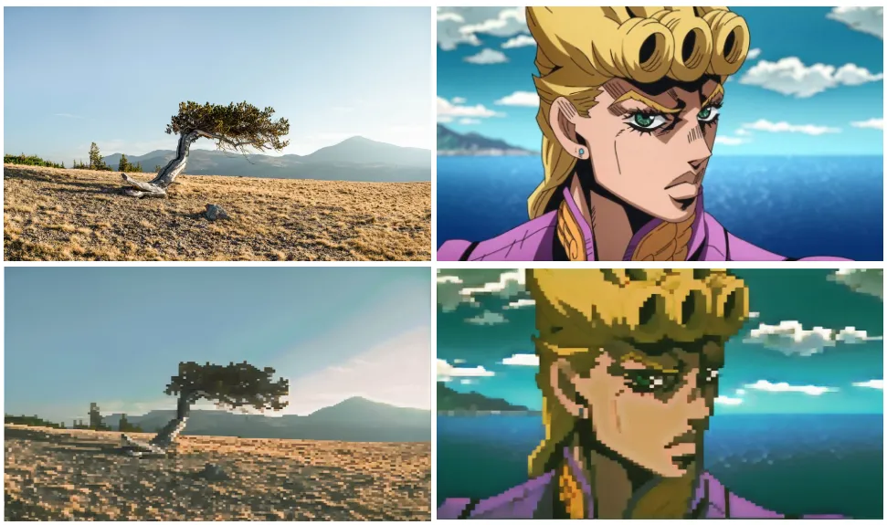
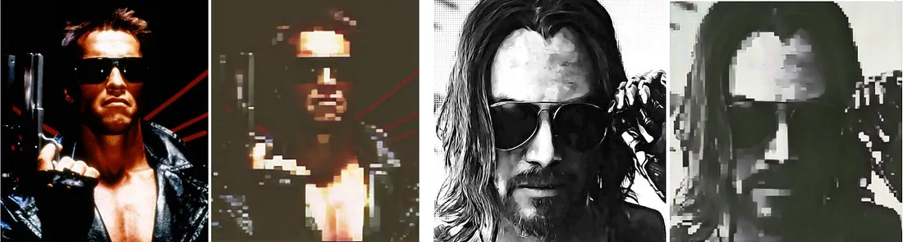
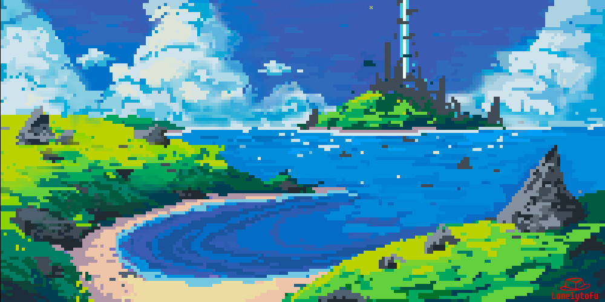

# Project Description 🦄

### What is the overall goal?
The goal of my project is to take an audio file( or just take the lyrics directly) and choose random lyrics from the song to generate an image to then turn that image into a piece of pixel art.

### Project Overview
Everyone loves to listen to music. Music is a beautiful thing because like a story or a painting everyone walks away with a different intrepretation. I wonder though what would be the interpretation of a machine. The goal of this project is to give the neural network a song and having it tokenize the audio to text, then taking that text and geenrating a pixelated version of that image. We will need to do image-image translation in order to make sure that the image that the neural network generates from the text gets pixelated. This approach is called "Neural Style Transfer". For the project we would also have to make use of a CycleGAN, which would allow us to train without paried examples. I am hopping to use the same approach as the authors of this article. In training the model with cartoon characters in a white background as domain A and pixelated cartoon characters on a white background for domain B. Here are some of the outcomes of their model.
 

For a more in depth reading of their approach read https://inikolaeva.medium.com/make-pixel-art-in-seconds-with-machine-learning-e1b1974ba572.

- Choosing random lyrics from a song and creating image based off of that.
- OR having the NN listen to the entire song and then generating an image.

 ## Introduction
Introductory Paragraph: We are team Pixelate! Our goal is to have a neural network generate an image based off of text given in the form of lyrics. Then taking that image and pixelating it.We want to replicate the cognitive process of making images in our mind when we listen to music. We want to develop a story that best resembles the song. 

Background Paragraph: All the process we are trying to make use of to accomplish our goal have been used in the past. Various steps involved. Need to decide whether we will use audio or lyrics for this project.

Transition Paragraph: Some insight that we applied to overcome the shortcomings of other approaches include

Details Paragraph: We have to overcome challenges such as ...

Assessment Paragraph: Overall we were successful in accomplishing our goal…

### What is Pixel art?
Pixel art is a cool and unique art style. It is very simple, with each picel block working together to create a final piece of art.

## Project Goals
1. Transcribe Audio to Lyrics.
2. Randomly select lyrics. Generate image based off of the randomly selected lyrics.
3. Collect training data 
4. Pixelate that image

Side note: I also had an idea of feeding a neural network a whole bunch of free novel data and then training it to write a short story or poem about any song it is given. This was my inspo https://openai.com/blog/better-language-models/.

## Ethical Sweep
Why Pixelate? It will be a fun and cool feature to add to any streaming site as well as a nice feature for people that are deaf and hard of hearing. But there are many ethical implications when it comes to how art is being utilized by AI.
A non-ML approach alternative to our study could include where certain keywords and phrases can show pre-made images. For example, a key word regarding ducks could show a pre-created image of a duck. While this could prove to be a valid alternative, the issue would rely on not making the image-creation process dynamic and tailored for the lyrics. For example, the song lyric could talk about ducks in space, but since no image of that exists, it would resort to using the next closest image.

Our process to handle appeals/ mistakes will take each claim seriously and address any parties that could have been harmed due to anything we have created. Our team is very diverse not only in race, but in background, and skill set helping us to get a variety of inputs to avoid as much error as possible. Our data (i.e. song lyrics) is valid for its intended use. Some bias in our data could be what image corresponds to. We hope to minimize bias in our data in model by looking through the dataset we decide to use and ensuring that there are not images that push a certain narrative or stereotypes. We can audit our data to ensure that the lyrics that we are using to create the pixelated images are clean so that we avoid situations where the AI creates graphical images. We can audit our code so that we have checkers in place so that for any graphical and unclean lyrics are not used when creating the images.

Some misinterpretations of the results could include slang words in lyrics, which had another meaning that what it was intended to mean in the song. Thereby, this could cause the created pixelate image to be something not related to the song lyrics. We might impinge individuals' privacy or anonymity if we happen to use a data set in which people are placed without their permission.

### Project Members
1. Kambe
2. Aldo 
3. Meelod 
4. Hasana 

## Related Works
This research article focuses on giving us an overview on the relation between artificial intelligence and art in our current world. It also brings up some ethical implications that come with using AI in art, such as questioning credibility and whether we should be using technology to make art [1]. 
This article discusses how a team worked to convert Audio to images [2].
In this paper, it discusses the practical and ethical implications of using AI to create forms of art. Some of the issues it discusses includes plagiarism and includes various examples of art works that were created with AI [3].
In this study, it discusses the potential issues with generating pixel art characters with AI. Some of those issues involve when the character is facing a certain direction and the blurriness of the image itself [4].
This article is an interview with Boris Dayma, the engineer behing Craiyon, formerly known as DALL-E Mini. It discusses his experience recreating DALL-E, as well as how the internet has decided to embrace his project (specifically for use with memes) [5].
This article discusses how to create our own text to image model. It discusses what Dall-E and Imagen are. It also talks through specific deep learning concepts and how they will work to accomplish our task [6].
This article takes you step by step on how to create an image in the style of pixel art. Gives background onto why we should use a CycleGAN for our project. Also gives background onto how to find data to help train our model [7].
This is an article about Point-E, a project by OpenAI which is like DALL-E except for 3d models. It goes over the training methods used for Point-E, which is currently available on GitHub & Hugging Face [8].
This research article focuses on how artificial neural networks have been used in visual arts from the past eight years. The article focuses on how different neural networks have been used to work with visual art all the way from classification to generation and evaluation [9].

## Works Cited
[1] Cetinic, Eva, and James She. “Understanding and Creating Art with AI: Review and Outlook.” ACM Transactions on Multimedia Computing, Communications, and Applications, vol. 18, no. 2, Feb. 2022, p. 66:1-66:22. May 2022, https://doi.org/10.1145/3475799.

[2] Chen, Tony. “Seeing Is Believing: Converting Audio Data into Images.” Medium, 23 Dec. 2020, https://towardsdatascience.com/seeing-is-believing-converting-audio-data-into-images-5ed1a2ca6647.

[3] Chen, Weiwen, et al. “A Methodological Approach to Create Interactive Art in Artificial Intelligence.” HCI International 2020 – Late Breaking Papers: Cognition, Learning and Games, edited by Constantine Stephanidis et al., Springer International Publishing, 2020, pp. 13–31. Springer Link, https://doi.org/10.1007/978-3-030-60128-7_2.

[4] Coutinho, Flávio, and Luiz Chaimowicz. “On the Challenges of Generating Pixel Art Character Sprites Using GANs.” Proceedings of the AAAI Conference on Artificial Intelligence and Interactive Digital Entertainment, vol. 18, no. 1, 1, Oct. 2022, pp. 87–94. ojs.aaai.org, https://doi.org/10.1609/aiide.v18i1.21951.

[5] How the Author of DALL-E Mini Created the Ultimate Meme Maker — and a New Era for AI. https://www.inverse.com/innovation/dall-e-mini-creator. Accessed 14 Feb. 2023.

[6] “MinImagen - Build Your Own Imagen Text-to-Image Model.” News, Tutorials, AI Research, 17 Aug. 2022, https://www.assemblyai.com/blog/minimagen-build-your-own-imagen-text-to-image-model/.

[7] Nikolaeva, Irina. “Make Pixel Art in Seconds with Machine Learning.” Medium, 22 Sept. 2021, https://inikolaeva.medium.com/make-pixel-art-in-seconds-with-machine-learning-e1b1974ba572.

[8] “Point-E: How OpenAI’s Dall-E Successor Uses AI to Sculpt Your 3D Dreams.” BBC Science Focus Magazine, https://www.sciencefocus.com/future-technology/point-e/. Accessed 14 Feb. 2023.

[9] Santos, Iria, et al. “Artificial Neural Networks and Deep Learning in the Visual Arts: A Review.” Neural Computing and Applications, vol. 33, no. 1, Jan. 2021, pp. 121–57. Springer Link, https://doi.org/10.1007/s00521-020-05565-4.
