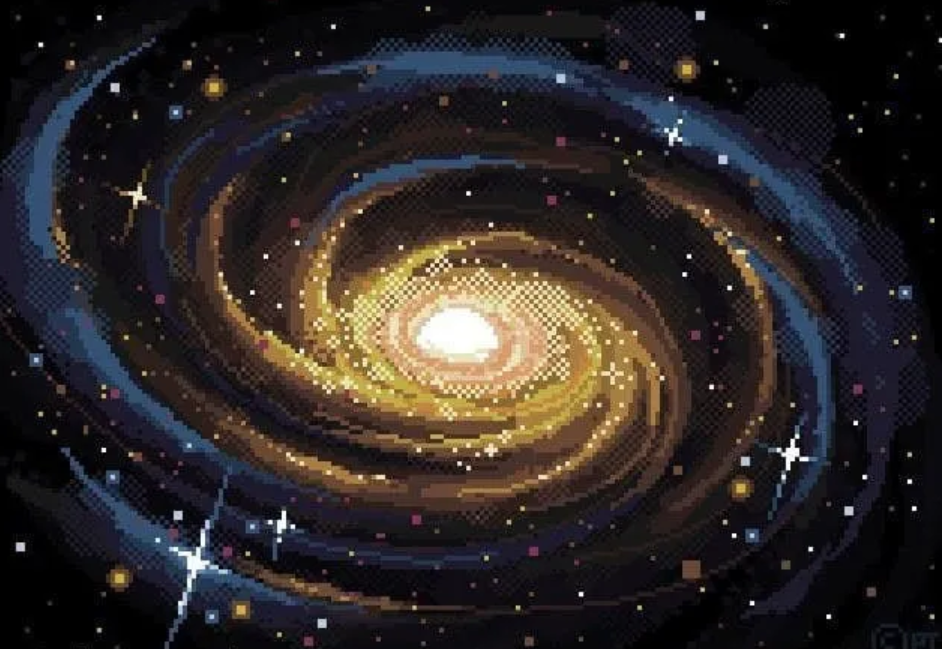
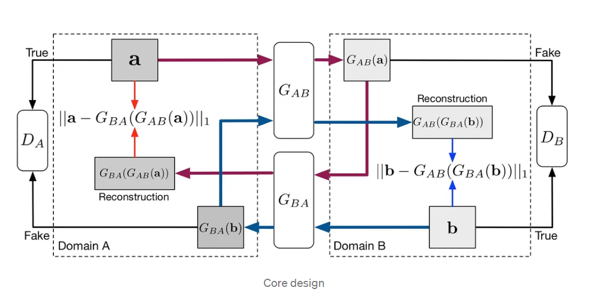
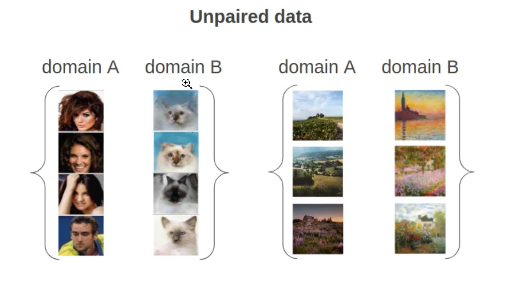

# Project Description 🦄

## **1. Introduction**
We are team Pixelate! Our goal is to have a neural network generate an image based off of text given in the form of lyrics. Then taking that image and pixelating it. We want to replicate the cognitive process of making images in our mind when we listen to music. Everyone loves to listen to music. Music is a beautiful thing because like a story or a painting everyone walks away with a different interpretation but how would a machine interpret the music and how can the machines' interpretation help to give imagery of a sound that some people may not have the ability to listen to.

Our Team:
1. Kambe
2. Aldo 
3. Meelod 
4. Hasana 

Project Goals
1. Transcribe Audio to Lyrics.
2. Randomly select lyrics. Generate image based off of the randomly selected lyrics.
3. Collect training data 
4. Pixelate that image

###   **1.1 What is Pixel Art?**
Pixel art is a cool and unique art style. It is very simple, with each pixel block working together to create a final piece of art. It is really popular nowadays due to its aesthetics and simplicity.

Image Source:
https://inikolaeva.medium.com/make-pixel-art-in-seconds-with-machine-learning-e1b1974ba572

### **1.2 The Task At Hand?**
The applications of artificial intelligence (AI) within the arts is not a new concept. Artificial neural networks, that have previously been used in optimization, prediction analysis, and natural language processing, are being used to create various forms of art: visually or audibly. In particular to visual arts, past use cases for these neural networks have involved image recognition of certain elements or entire artwork, classification based on key aspects, prediction analysis on quality or aesthetic, and style transfer from one visual artwork to another (Santos et al.). Further developments within artificial intelligence in visual arts have allowed artificial neural networks to reconstruct their own unique images through training and learning from examples of past artworks (Artdex). For our project we would like to train a neural network to generate an image based off of a wide selection of images that it will be trained on, and then to have that image be converted into the style of pixel art.

 

Image Source:
https://inikolaeva.medium.com/make-pixel-art-in-seconds-with-machine-learning-e1b1974ba572

### **1.3 How Do We Differ?**
Our project is more focused on the current trend of using AI for art generation. Researchers like Eva Cetinic and her colleagues explore the current developing relationship between artificial intelligence and art in our modern world [1]. Specifically, they question some ethical implications that come with the process of AI art generation such as asking if we should even use AI for the art generation, what the creative process behind AI art is, and the credibility and copyright issues that come along the process of developing art. Furthermore, Chen and colleagues continue on to explore the benefits and complexities behind artists using artificial intelligence as a tool. They mention that while artists may be able to alleviate the laborious process of artistic creation to make room to maximize their creative expressions, AI art may lead to further issues in the future including plagiarism  [3]. Therefore, our objective will be to analyze these implications through our project and extend the applications of artificial intelligence in order to pixelate lyrics of songs.

## **2. Our Approach**
Our project will have two separate steps. First we will be generating an image based on a text prompt. This is similar to the process of Dall-E and the numerous programs that have come after (ex: Craiyon, a free version of Dall-E created by engineer Boris Dayma [5]). We will also be using the inspiration of other models, such as Dall-E 2 and Imagen, and tutorials in order to replicate the text-to-image generation process. [6]. Our goal is not only to replicate the process through this step but also to make it more efficient and implement pixelation based on music lyrics. In our second step we will be pixelating our generated image, transforming it into pixel art. Programs to pixelate images have been around for years, with many popular programs using CycleGAN [7]. Still, there can be many issues with generating pixel art, specifically with blurriness of images and sprite generation for pixelated characters [4].

Image Source:
https://inikolaeva.medium.com/make-pixel-art-in-seconds-with-machine-learning-e1b1974ba572

### **2.1 The Data**
For our project there will be two things we have to train the neural network one, generating images from text and converting images to pixelated art images. For this we must have distinct data sets for each separate goal. Our data set for image generation based on text would consist of a host of labeled images. Our data set for image-image generation would have to consists of unpaired data in order to facilitate the neural networks learning on how to turn an image into a pixelated version of itself. (Need to expand on this more)

Image Source:
https://inikolaeva.medium.com/make-pixel-art-in-seconds-with-machine-learning-e1b1974ba572

## **3.Ethics and Our Why?**
Why Pixelate? Pixelate will be a fun and cool feature to add to any streaming site as well as a nice feature for people that are deaf and hard of hearing. But there are many ethical implications when it comes to how art is being utilized by AI. A non-ML approach alternative to our project could include where certain keywords and phrases can show pre-made images. For example, a key word regarding ducks could show a pre-created image of a duck. While this could prove to be a valid alternative, the issue would rely on not making the image-creation process dynamic and tailored for the lyrics. For example, the song lyric could talk about ducks in space, but since no image of that exists, it would resort to using the next closest image.
Our process to handle appeals/ mistakes will take each claim seriously and address any parties that could have been harmed due to anything we have created. Our team is very diverse not only in race, but in background, and skill set helping us to get a variety of inputs to avoid as much error as possible. Our data (i.e. song lyrics) is valid for its intended use. Some bias in our data could be what image corresponds to. We hope to minimize bias in our data in model by looking through the dataset we decide to use and ensuring that there are no images that push a certain narrative or stereotypes. We can audit our data to ensure that the lyrics that we are using to create the pixelated images are clean so that we avoid situations where the AI creates graphical images. We can audit our code so that we have checkers in place so that for any graphical and unclean lyrics are not used when creating the images.
Some misinterpretations of the results could include slang words in lyrics, which had another meaning that what it was intended to mean in the song. Thereby, this could cause the created pixelate image to be something not related to the song lyrics. We might impinge individuals' privacy or anonymity if we happen to use a data set in which people are placed without their permission.

## **4.   References**
[1] Cetinic, Eva, and James She. “Understanding and Creating Art with AI: Review and Outlook.” ACM Transactions on Multimedia Computing, Communications, and Applications, vol. 18, no. 2, Feb. 2022, p. 66:1-66:22. May 2022, https://doi.org/10.1145/3475799.

[2] Chen, Tony. “Seeing Is Believing: Converting Audio Data into Images.” Medium, 23 Dec. 2020, https://towardsdatascience.com/seeing-is-believing-converting-audio-data-into-images-5ed1a2ca6647.

[3] Chen, Weiwen, et al. “A Methodological Approach to Create Interactive Art in Artificial Intelligence.” HCI International 2020 – Late Breaking Papers: Cognition, Learning and Games, edited by Constantine Stephanidis et al., Springer International Publishing, 2020, pp. 13–31. Springer Link, https://doi.org/10.1007/978-3-030-60128-7_2.

[4] Coutinho, Flávio, and Luiz Chaimowicz. “On the Challenges of Generating Pixel Art Character Sprites Using GANs.” Proceedings of the AAAI Conference on Artificial Intelligence and Interactive Digital Entertainment, vol. 18, no. 1, 1, Oct. 2022, pp. 87–94. ojs.aaai.org, https://doi.org/10.1609/aiide.v18i1.21951.

[5] How the Author of DALL-E Mini Created the Ultimate Meme Maker — and a New Era for AI. https://www.inverse.com/innovation/dall-e-mini-creator. Accessed 14 Feb. 2023.

[6] “MinImagen - Build Your Own Imagen Text-to-Image Model.” News, Tutorials, AI Research, 17 Aug. 2022, https://www.assemblyai.com/blog/minimagen-build-your-own-imagen-text-to-image-model/.

[7] Nikolaeva, Irina. “Make Pixel Art in Seconds with Machine Learning.” Medium, 22 Sept. 2021, https://inikolaeva.medium.com/make-pixel-art-in-seconds-with-machine-learning-e1b1974ba572.

[8] “Point-E: How OpenAI’s Dall-E Successor Uses AI to Sculpt Your 3D Dreams.” BBC Science Focus Magazine, https://www.sciencefocus.com/future-technology/point-e/. Accessed 14 Feb. 2023.

[9] Santos, Iria, et al. “Artificial Neural Networks and Deep Learning in the Visual Arts: A Review.” Neural Computing and Applications, vol. 33, no. 1, Jan. 2021, pp. 121–57. Springer Link, https://doi.org/10.1007/s00521-020-05565-4.

